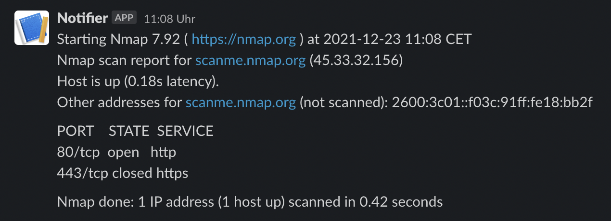

# notifier
> Tiny helper for publishing notifications on different platforms: 
- #slack
- Amazon SNS
- Microsoft Teams
- Custom Webhooks

```bash
nmap -p80,443 scanme.nmap.org | notifier -b
```
<div align="center">
  </a>
</div>

## Installing
You can install the pre-compiled binary in several different ways

### homebrew tap:
```bash
brew tap hupe1980/notifier
brew install notifier
```

### snapcraft:
[](https://snapcraft.io/notifier)
```bash
sudo snap install notifier
```

### scoop:
```bash
scoop bucket add notifier https://github.com/hupe1980/notifier-bucket.git
scoop install notifier
```

### deb/rpm/apk:

Download the .deb, .rpm or .apk from the [releases page](https://github.com/hupe1980/notifier/releases) and install them with the appropriate tools.

### manually:
Download the pre-compiled binaries from the [releases page](https://github.com/hupe1980/notifier/releases) and copy to the desired location.

## Usage
```console
Usage:
  notifier [filename] [flags]

Examples:
nmap -p80,443 scanme.nmap.org | notifier -b

Flags:
  -b, --bulk                   enable bulk processing
  -c, --config string          path to notifier configuration file (default: $HOME/.config/notifier/config.yaml)
  -e, --extra stringArray      additional informations for use in the template (key=value)
  -h, --help                   help for notifier
  -p, --provider stringArray   provider to send the notification to
      --proxy string           proxy url
      --rate-limit int         maximum number of HTTP requests per second
  -v, --version                version for notifier
```

### Config
The default config file must be created at $HOME/.config/notifier/config.yaml and can have the following contents:

```yaml
proxy: http://proxy.org
rateLimit: 5
providers:
  webhook:
    - id: webhook
      url: https://webhook.org
      method: POST
      template: '{{ .Message }}'
      headers:
        Content-Type: application/json
        X-Api-Key: 4711
  slack:
    - id: slack
      webhookUrl: https://hooks.slack.com/services/xxx
      template: '{{ .Message }}'
  teams:
    - id: teams
      webhookUrl: https://outlook.office.com/webhook/xxx
      template: '{{ .Message }}'
  sns:
    - id: sns
      region: us-east-1
      profile: notifier
      topicArn: arn:aws:sns:us-east-1:123456789012:MyTopic
```

### Template
`notifier` uses `{{ .Message }}` as the default template. You can customize the template with the following placeholders:
- {{ .Message }}
- {{ .Username }}
- {{ .Hostname }}

## References
- [#slack Incoming Webhooks](https://api.slack.com/messaging/webhooks)
- [Microsoft Teams Incoming Webhooks](https://docs.microsoft.com/en-us/microsoftteams/platform/webhooks-and-connectors/how-to/add-incoming-webhook)
- [Amazon SNS](https://docs.aws.amazon.com/sns/latest/dg/welcome.html)

## License
[MIT](LICENCE)

